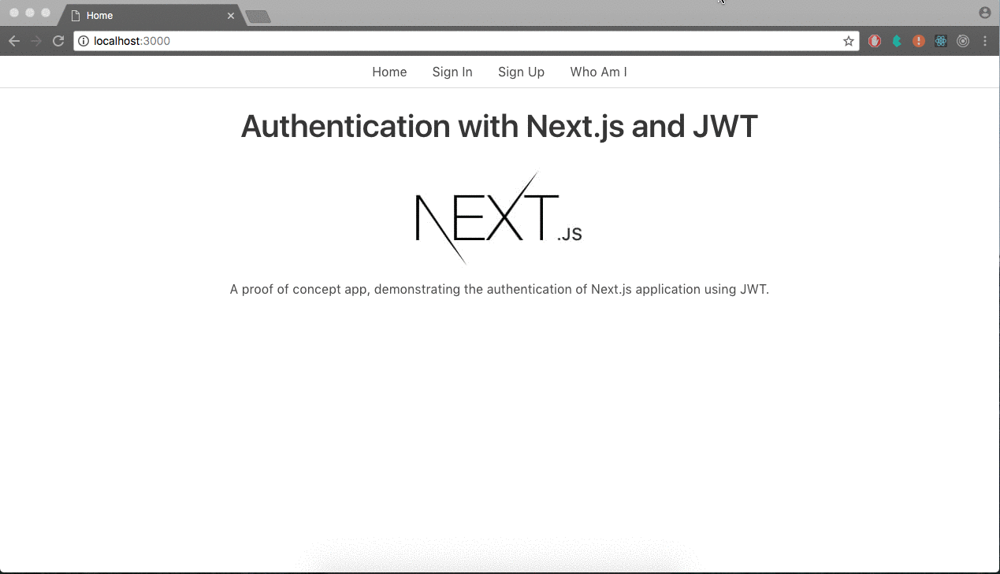

# fullstack authentication example

Local authentication example with express and nextjs using TypeScript.

## Prerequisites

[Mongodb](https://docs.mongodb.com/manual/installation/) instance running, either locally or from an online service.

## Getting started

### Install

```bash
# In root directory
npm i
```

### Start development server

> ⚠ See section bugs.

```bash
# In root directory
npm run dev
```

### Build production server

```bash
# In root directory
npm run build
```

### Start production server

You need to run the build script first!

```bash
# In root directory
npm start
```

## Used Frameworks

* TypeScript
* Express
* Mongoose
* Jest
* Passport
* JWT
* React
* Redux
* gulp

## Idea

I was searching for an example project doing exactly what i wanted.
Authentication between NextJS Frontend and Express Backend using TypeScript.
I found an project which is splitted in [Back](https://github.com/alan2207/express-server-jwt)
and [Frontend](https://github.com/alan2207/nextjs-jwt-authentication), but it wasn't written with TypeScript.
So I decided to rewrite it in TypeScript and also add some testing.



## Bugs

* You can't run the development Server for the Frontend, you have to build the production Server and start that one.

## Troubleshooting

### Backend

#### MongoNetworkError

```
unhandledRejection: MongoNetworkError: failed to connect to server [localhost:27017] on first connect [Error: connect ECONNREFUSED 127.0.0.1:27017
    at TCPConnectWrap.afterConnect [as oncomplete] (net.js:1056:14) {
  name: 'MongoNetworkError',
  errorLabels: [Array],
  [Symbol(mongoErrorContextSymbol)]: {}
}]
```

If you get this error Message, you will most probably not have an instance of Mongo DB running or you have a wrong mongo url in your config file.
As a reminder, a mongodb url has to look at least like this: `mongodb://<ip>:<port>`.

#### config

```
Error: Cannot find module './config'
```

If you get this error Message, you need to create a config file under `api/src/config.ts` with the following content.

```typescript
export const db: string = "mongodb://localhost:27017/authenticationApi"; // Mongo DB URL
export const port: string = "8000"; // API Server Port
export const secret: string = "my-super-duper-mega-secret-secret"; // Secret for the passport strategy
```

#### Key to large for Mongo DB

If you have a local Mongo DB instance running, you may encounter the problem, that mongod tells you, that the key is to large.
In this case you need to start mongod with the option `--setParameter failIndexKeyTooLong=false`.

### Frontend

#### config

```
Failed to compile.

./src/redux/actions/authActions.ts
Module not found: Can't resolve '../../../config' in ...
```

If you get this error Message, you need to create a config file under `www/config.ts` with the following content.

```typescript
export const API: string = 'http://localhost:8000';
```

## Author

* Daniel Nagel - danielsenpai95gmail.com